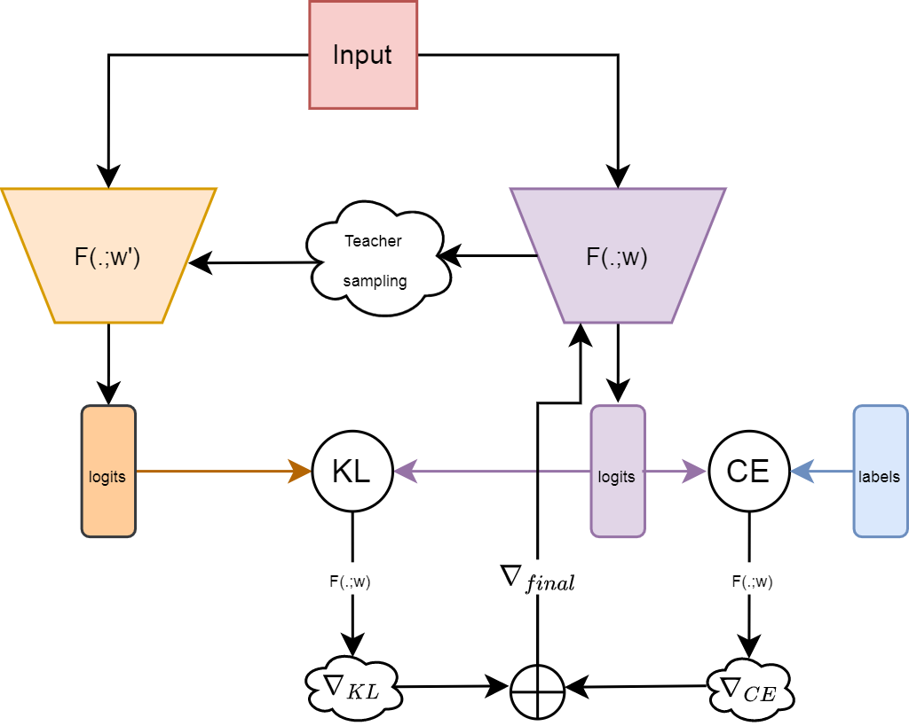

# SADT
This repository contians the code for NeuIPS HITY workshop apaper "SADT: Combining Sharpness-Aware Minimization with Self-Distillation for Improved Model Generalization". Provided code is one-step solution to reproduce the results from the Paper.

